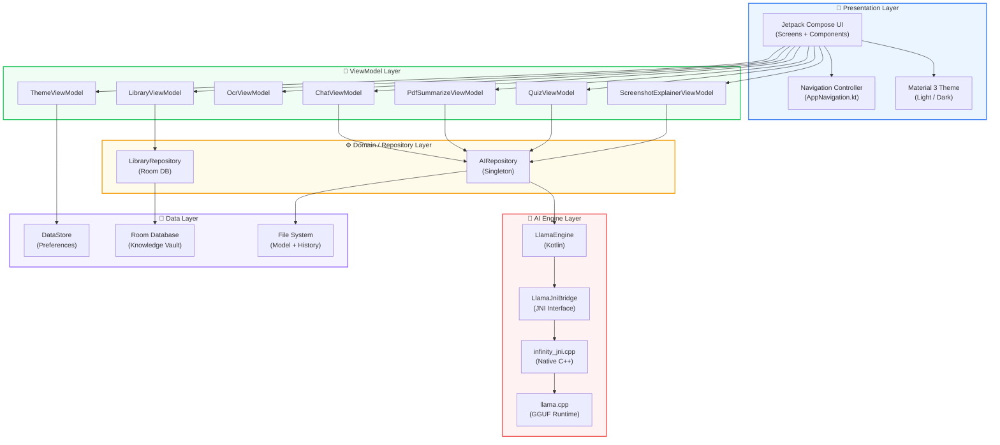

<div align="center">

# ♾️ Infinity AI

### **Your Private, Offline-First AI Assistant — Right in Your Pocket**

[](https://kotlinlang.org)
[](https://developer.android.com/compose)
[](https://developer.android.com)
[](https://github.com/ggerganov/llama.cpp)
[](LICENSE)

<br/>

> **Infinity AI** is a premium, startup-grade Android application that runs a **full large language model (LLM) entirely on-device** using `llama.cpp` and native C++ via JNI — no internet, no cloud, no data leaving your phone. Ever.

<br/>

**🔒 100% Private** · **✈️ Works Offline** · **⚡ Real-Time Streaming** · **📱 On-Device AI**

---

</div>

<br/>

## 📑 Table of Contents

- [✨ Features](#-features)
- [🏗️ Architecture](#️-architecture)
- [📂 Project Structure](#-project-structure)
- [🛠️ Tech Stack](#️-tech-stack)
- [🚀 Getting Started](#-getting-started)
- [📲 Build & Run](#-build--run)
- [🎨 Design System](#-design-system)
- [🧠 AI Engine Deep Dive](#-ai-engine-deep-dive)
- [📱 Screens & Features](#-screens--features)
- [🔧 Configuration](#-configuration)
- [🗺️ Roadmap](#️-roadmap)
- [👥 Contributing](#-contributing)
- [📄 License](#-license)

---

<br/>

## ✨ Features

<table>
<tr>
<td width="50%">

### 🤖 AI Chat Assistant
- **On-device LLM** powered by Qwen 2.5 (GGUF)
- **Real-time token streaming** via C++ JNI callbacks
- **Thinking Mode** & **Deep Research** toggles
- Code block rendering with syntax highlighting
- Copy, share, save, regenerate actions
- Chat history persistence

</td>
<td width="50%">

### 🔍 Circle Learn (System-Wide AI)
- **Draw a circle** around anything on screen
- AI explains selected content instantly
- Floating bubble overlay service
- Screenshot capture + region selection
- Works across **any app** on your device

</td>
</tr>
<tr>
<td width="50%">

### 📄 Document Intelligence
- **PDF Summarizer** — Extract & summarize PDFs
- **OCR Scanner** — Extract text from images via ML Kit
- **File Analyzer** — Understand document contents
- **Screenshot Explainer** — AI explains any screenshot

</td>
<td width="50%">

### 🎓 Learning Tools
- **AI Quiz Generator** — Auto-generate quizzes from content
- **Knowledge Vault** — Auto-save & organize AI interactions
- **Voice Assistant** — Hands-free AI conversations
- **Smart Search** — Intelligent content discovery

</td>
</tr>
</table>

<br/>

### 🌟 Premium Highlights

| Feature | Description |
|---------|------------|
| 🔐 **Privacy First** | All processing happens on-device. Zero data transmitted. |
| ✈️ **Offline First** | No internet required. Works in airplane mode. |
| ⚡ **Streaming Responses** | Tokens appear in real-time as the model generates. |
| 🎨 **Material 3 Design** | Modern, clean, premium startup-grade UI. |
| 🌗 **Light & Dark Themes** | Fully themed with persistent user preference. |
| 📎 **Native File Pickers** | Attach images & documents from system pickers. |
| 🧠 **Context Window** | 2048-token context with 20-message history. |
| 🔄 **Auto-Save** | Chat history & AI responses saved to Knowledge Vault. |

---

<br/>

## 🏗️ Architecture

Infinity AI follows a clean **MVVM (Model-View-ViewModel)** architecture with a layered separation of concerns:



### 🔄 Data Flow — Chat Message Lifecycle

```
┌──────────┐     ┌──────────────┐     ┌─────────────┐     ┌───────────┐     ┌───────────┐
│  User    │────▶│ ChatScreen   │────▶│ ChatViewModel│────▶│AIRepository│────▶│LlamaEngine│
│  Input   │     │ (Compose)    │     │ (StateFlow)  │     │(Singleton) │     │ (Kotlin)  │
└──────────┘     └──────────────┘     └─────────────┘     └───────────┘     └─────┬─────┘
                                                                                   │
                        ┌──────────────────────────────────────────────────────────┘
                        ▼
              ┌─────────────────┐     ┌──────────────┐     ┌──────────────┐
              │ LlamaJniBridge  │────▶│infinity_jni  │────▶│  llama.cpp   │
              │   (JNI calls)   │     │   (.cpp)     │     │ (GGUF model) │
              └────────┬────────┘     └──────────────┘     └──────────────┘
                       │
                       │  Callback: onToken("Hello") ← C++ thread
                       ▼
              ┌─────────────────┐
              │  callbackFlow   │──▶  UI updates token-by-token in real-time
              │  (Kotlin Flow)  │
              └─────────────────┘
```

### 🔑 Key Architectural Decisions

| Decision | Rationale |
|----------|-----------|
| **JNI + C++ for inference** | llama.cpp runs natively for maximum performance on ARM64 NEON |
| **AtomicReference for state** | Thread-safe state transitions from C++ JNI callback threads |
| **callbackFlow + Channel.UNLIMITED** | Bridges C++ callbacks into Kotlin coroutines without backpressure drops |
| **Singleton Repository** | Single model instance — avoids duplicate 1GB+ memory allocations |
| **Room for Knowledge Vault** | Structured storage with query support for saved AI interactions |
| **DataStore for preferences** | Lightweight, coroutine-based key-value storage for theme & onboarding |

---

<br/>

## 📂 Project Structure

```
infinity-ai/
├── 📄 build.gradle.kts                  # Root build configuration
├── 📄 settings.gradle.kts               # Project settings & plugin management
├── 📄 gradle.properties                 # JVM args & AndroidX config
├── 📁 gradle/
│   └── 📄 libs.versions.toml            # Version catalog (all dependency versions)
│
└── 📁 app/
    ├── 📄 build.gradle.kts              # App module config (SDK, NDK, CMake, deps)
    │
    └── 📁 src/main/
        ├── 📄 AndroidManifest.xml       # Permissions, activities, services
        │
        ├── 📁 cpp/                      # ═══ NATIVE C++ LAYER ═══
        │   ├── 📄 CMakeLists.txt        # CMake build for llama.cpp + JNI
        │   ├── 📄 infinity_jni.cpp      # JNI bridge: Kotlin ←→ llama.cpp
        │   ├── 📄 infinity_jni_stub.cpp # Stub for builds without model
        │   └── 📁 llama/               # llama.cpp source (vendored)
        │
        ├── 📁 res/                      # Resources (drawables, layouts, values)
        │
        └── 📁 java/com/infinity/ai/
            │
            ├── 📄 MainActivity.kt       # App entry point, edge-to-edge, theme
            │
            ├── 📁 ai/                   # ═══ AI ENGINE MODULE ═══
            │   ├── 📁 engine/
            │   │   ├── 📄 LlamaEngine.kt       # LLM engine (load, generate, stop)
            │   │   └── 📄 LocalAIEngine.kt      # Engine interface / contract
            │   ├── 📁 runtime/
            │   │   └── 📄 LlamaJniBridge.kt     # JNI declarations + LlamaCallback
            │   ├── 📁 prompts/
            │   │   └── 📄 PromptFormatter.kt     # ChatML prompt builder (Qwen 2.5)
            │   ├── 📁 repository/
            │   │   └── 📄 AIRepository.kt        # Singleton: model lifecycle manager
            │   ├── 📁 state/                     # AIInferenceState sealed class
            │   ├── 📁 storage/                   # Model file management
            │   └── 📁 streaming/                 # Token streaming utilities
            │
            ├── 📁 circle/               # ═══ CIRCLE LEARN MODULE ═══
            │   ├── 📄 CircleLearnActivity.kt      # Transparent overlay activity
            │   ├── 📄 CircleLearnBottomSheet.kt   # AI explanation bottom sheet
            │   ├── 📄 CircleLearnProcessor.kt     # Screen region → AI pipeline
            │   ├── 📄 CircleLearnViewModel.kt     # Circle Learn state management
            │   ├── 📄 ContentTypeDetector.kt      # Detects text/image/code content
            │   ├── 📄 FloatingBubbleView.kt       # System-wide floating bubble
            │   ├── 📄 InfinityOverlayService.kt   # Foreground overlay service
            │   ├── 📄 OverlayComposeHost.kt       # Compose in overlay windows
            │   ├── 📄 OverlayPermissionHelper.kt  # Permission request utilities
            │   └── 📄 RegionSelectionView.kt      # Draw-to-select region UI
            │
            ├── 📁 data/                 # ═══ DATA LAYER ═══
            │   ├── 📄 OnboardingPreference.kt     # Onboarding completion state
            │   ├── 📄 ThemePreference.kt           # Dark/Light mode preference
            │   └── 📁 library/
            │       ├── 📄 LibraryDao.kt            # Room DAO for Knowledge Vault
            │       ├── 📄 LibraryDatabase.kt       # Room database definition
            │       ├── 📄 LibraryEntry.kt          # Entity: saved AI interactions
            │       └── 📄 LibraryRepository.kt     # Repository pattern for DB
            │
            ├── 📁 model/                # ═══ DATA MODELS ═══
            │   └── 📄 ChatMessage.kt              # Chat message data class
            │
            ├── 📁 ocr/                  # ═══ OCR MODULE ═══
            │   ├── 📄 OcrTextExtractor.kt          # ML Kit text recognition
            │   └── 📄 AiTextProcessor.kt           # AI-powered text processing
            │
            ├── 📁 pdf/                  # ═══ PDF MODULE ═══
            │   └── 📄 PdfTextExtractor.kt          # PDF text extraction engine
            │
            ├── 📁 viewmodel/            # ═══ VIEWMODEL LAYER ═══
            │   ├── 📄 ChatViewModel.kt             # Chat + streaming + history
            │   ├── 📄 ThemeViewModel.kt             # Theme toggle state
            │   ├── 📄 OcrViewModel.kt               # OCR scan state
            │   ├── 📄 PdfSummarizeViewModel.kt      # PDF summary state
            │   ├── 📄 QuizViewModel.kt              # Quiz generation state
            │   ├── 📄 ScreenshotExplainerViewModel.kt # Screenshot AI state
            │   └── 📄 LibraryViewModel.kt           # Knowledge Vault state
            │
            └── 📁 ui/                   # ═══ UI LAYER ═══
                ├── 📁 theme/
                │   ├── 📄 Color.kt                 # Color palette definitions
                │   ├── 📄 Theme.kt                 # Material 3 theme config
                │   └── 📄 Type.kt                  # Typography system
                ├── 📁 components/
                │   ├── 📄 AiBodyOrb.kt             # Animated AI visualization orb
                │   └── 📄 Components.kt            # Shared reusable composables
                ├── 📁 navigation/
                │   └── 📄 AppNavigation.kt         # NavHost, routes, bottom bar
                └── 📁 screens/
                    ├── 📄 SplashScreen.kt           # Animated splash
                    ├── 📄 OnboardingScreen.kt       # 3-screen onboarding flow
                    ├── 📄 DashboardScreen.kt        # Main AI command center
                    ├── 📄 ChatScreen.kt             # AI chat with streaming
                    ├── 📄 ToolsScreen.kt            # AI toolkit grid
                    ├── 📄 SettingsScreen.kt          # App settings & theme
                    ├── 📄 VoiceScreen.kt             # Voice assistant UI
                    ├── 📄 OcrScreen.kt               # OCR scanner UI
                    ├── 📄 PdfSummaryScreen.kt        # PDF summarizer UI
                    ├── 📄 QuizScreen.kt              # AI quiz UI
                    ├── 📄 LibraryScreen.kt           # Knowledge Vault browser
                    ├── 📄 CircleLearnEntryScreen.kt  # Circle Learn launcher
                    ├── 📄 ScreenshotExplainerScreen.kt # Screenshot AI UI
                    └── 📄 SharedFeatureComponents.kt # Shared screen composables
```

---

<br/>

## 🛠️ Tech Stack

<table>
<tr>
<th>Category</th>
<th>Technology</th>
<th>Version</th>
<th>Purpose</th>
</tr>
<tr>
<td>🟣 <b>Language</b></td>
<td>Kotlin</td>
<td><code>2.0.21</code></td>
<td>Primary development language</td>
</tr>
<tr>
<td>🔵 <b>UI Framework</b></td>
<td>Jetpack Compose + Material 3</td>
<td>BOM <code>2024.09</code></td>
<td>Declarative, reactive UI</td>
</tr>
<tr>
<td>🟢 <b>Navigation</b></td>
<td>Compose Navigation</td>
<td><code>2.8.9</code></td>
<td>Type-safe screen navigation</td>
</tr>
<tr>
<td>🟡 <b>State Mgmt</b></td>
<td>StateFlow + ViewModel</td>
<td><code>2.9.x</code></td>
<td>Reactive state observation</td>
</tr>
<tr>
<td>🔴 <b>AI Engine</b></td>
<td>llama.cpp (C++ via JNI)</td>
<td>Latest</td>
<td>On-device LLM inference</td>
</tr>
<tr>
<td>🟠 <b>AI Model</b></td>
<td>Qwen 2.5 (GGUF format)</td>
<td>Q4_K_M</td>
<td>Quantized LLM for mobile</td>
</tr>
<tr>
<td>🟤 <b>NDK / CMake</b></td>
<td>Android NDK</td>
<td><code>28.2</code></td>
<td>Native C++ compilation (ARM64 NEON)</td>
</tr>
<tr>
<td>🟣 <b>Database</b></td>
<td>Room</td>
<td><code>2.7.1</code></td>
<td>Knowledge Vault persistence</td>
</tr>
<tr>
<td>🔵 <b>Preferences</b></td>
<td>DataStore</td>
<td><code>1.1.7</code></td>
<td>Theme & onboarding state</td>
</tr>
<tr>
<td>🟢 <b>OCR</b></td>
<td>Google ML Kit</td>
<td><code>16.0.1</code></td>
<td>Text recognition from images</td>
</tr>
<tr>
<td>🟡 <b>Build System</b></td>
<td>Gradle + KTS + KSP</td>
<td><code>8.10.1</code></td>
<td>Build automation & annotation processing</td>
</tr>
<tr>
<td>🔴 <b>Min SDK</b></td>
<td>Android 7.0</td>
<td>API <code>24</code></td>
<td>Broad device compatibility</td>
</tr>
<tr>
<td>🟠 <b>Target SDK</b></td>
<td>Android 16</td>
<td>API <code>36</code></td>
<td>Latest platform features</td>
</tr>
</table>

---

<br/>

## 🚀 Getting Started

### Prerequisites

Before you begin, ensure you have the following installed:

| Requirement | Minimum Version | Download |
|------------|----------------|----------|
| **Android Studio** | Ladybug (2024.2+) | [Download](https://developer.android.com/studio) |
| **JDK** | 17+ (JDK 24 recommended) | [Download](https://www.oracle.com/java/technologies/downloads/) |
| **Android NDK** | 28.2.13676358 | Via SDK Manager |
| **CMake** | 3.22.1 | Via SDK Manager |
| **Git** | 2.x | [Download](https://git-scm.com) |
| **Physical Device** | ARM64 (arm64-v8a) | 6GB+ RAM recommended |

> [!IMPORTANT]
> **A physical ARM64 device is required** for running the AI model. The app includes native C++ code compiled specifically for `arm64-v8a`. Emulators will not work for AI inference.

### Clone the Repository

```bash
git clone https://github.com/subhashmalik0001/Infinity.ai.git
cd Infinity.ai
```

### Install NDK & CMake

Open **Android Studio → SDK Manager → SDK Tools** and install:
- ✅ NDK (Side by side) — version `28.2.13676358`
- ✅ CMake — version `3.22.1`

---

<br/>

## 📲 Build & Run

### Option 1: Android Studio (Recommended)

```
1. Open the project in Android Studio
2. Wait for Gradle sync to complete
3. Connect your ARM64 Android device via USB
4. Enable USB Debugging on the device
5. Click ▶ Run (or Shift + F10)
```

### Option 2: Command Line

```bash
# Set your JDK path (adjust version as needed)
export JAVA_HOME=/Library/Java/JavaVirtualMachines/jdk-24.jdk/Contents/Home

# Compile and check for errors
./gradlew compileDebugKotlin

# Build and install on connected device
./gradlew :app:installDebug

# Launch the app
adb shell am start -n com.infinity.ai/.MainActivity
```

### Option 3: Build APK Only

```bash
# Generate debug APK
./gradlew assembleDebug

# APK location:
# app/build/outputs/apk/debug/app-debug.apk
```

> [!TIP]
> **First launch will take ~30 seconds** while the AI model is extracted from assets to internal storage. This only happens once. A progress bar is displayed during extraction.

---

<br/>

## 🎨 Design System

Infinity AI uses a custom **Material 3** design system built for a premium AI product aesthetic.

### Color Palette

| Swatch | Name | Hex | Usage |
|--------|------|-----|-------|
| 🔵 | **Blue Primary** | `#2563EB` | Primary actions, links, send button |
| 🌊 | **Blue 50** | `#EFF6FF` | Light blue backgrounds, badges |
| ⚪ | **Card White** | `#FFFFFF` | Card surfaces, input backgrounds |
| 📝 | **Text Primary** | `#0F172A` | Headlines, body text |
| 📄 | **Text Secondary** | `#64748B` | Captions, hints, timestamps |
| 🔲 | **Border Light** | `#E2E8F0` | Card borders, dividers |
| ✅ | **Success Green** | `#22C55E` | Success states, confirmations |
| 🔴 | **Error Red** | `#EF4444` | Error states, stop button |
| 🟡 | **Gold Accent** | `#DD9F0B` | Logo glow, premium highlights |

### Typography

The app uses the system default Material 3 typography with custom weight adjustments:
- **Headlines**: Bold, `FontWeight.Bold`
- **Body**: Regular, `lineHeight = 22.sp`
- **Labels**: Medium, `FontWeight.Medium`
- **Code blocks**: `FontFamily.Monospace`

### Component Library

| Component | Description |
|-----------|-------------|
| `AiBodyOrb` | Animated pulsing AI visualization orb |
| `GlassyChip` | Frosted-glass action chips with shadow |
| `AttachmentPill` | Dismissible file preview badges |
| `CodeBlockView` | Syntax-highlighted code with copy button |
| `ChatBubble` | User/AI message bubbles with actions |
| `RecentSearchItem` | History list items with star ratings |
| `AITaskCard` | Dashboard quick-action cards |

---

<br/>

## 🧠 AI Engine Deep Dive

### How On-Device Inference Works

```
                    ┌─────────────────────────────────────────┐
                    │              KOTLIN LAYER                │
                    │                                         │
   User types ──▶   │  ChatViewModel.sendMessage()            │
   "Hello!"        │       │                                  │
                    │       ▼                                  │
                    │  AIRepository.generate(history, input)   │
                    │       │                                  │
                    │       ▼                                  │
                    │  LlamaEngine.generate()                  │
                    │       │  ← callbackFlow { ... }          │
                    │       ▼                                  │
                    │  PromptFormatter.buildPrompt()           │
                    │       │  ← ChatML format for Qwen 2.5   │
                    │       ▼                                  │
                    │  LlamaJniBridge.generate(prompt, cb)     │
                    │       │  ← external fun (JNI call)       │
                    └───────┼─────────────────────────────────┘
                            │
                    ════════╪══════════════════════════════════
                     JNI    │  BOUNDARY
                    ════════╪══════════════════════════════════
                            │
                    ┌───────┼─────────────────────────────────┐
                    │       ▼           C++ LAYER              │
                    │                                         │
                    │  infinity_jni.cpp                        │
                    │       │                                  │
                    │       ▼                                  │
                    │  llama_decode() loop                     │
                    │       │                                  │
                    │       ├──▶ onToken("Hello")  ─── JNI ──▶ Kotlin Flow
                    │       ├──▶ onToken(" there") ─── JNI ──▶ Kotlin Flow
                    │       ├──▶ onToken("!")       ─── JNI ──▶ Kotlin Flow
                    │       └──▶ onComplete()       ─── JNI ──▶ channel.close()
                    │                                         │
                    └─────────────────────────────────────────┘
```

### Prompt Format — ChatML (Qwen 2.5)

The model uses the **ChatML** prompt template. Incorrect formatting will produce garbage output.

```
<|im_start|>system
You are Infinity, a helpful, concise, and intelligent AI assistant.
You run entirely offline on the user's device.
Be direct and helpful. Keep responses focused and clear.<|im_end|>
<|im_start|>user
What is quantum computing?<|im_end|>
<|im_start|>assistant
```

### Engine Configuration

| Parameter | Value | Description |
|-----------|-------|-------------|
| `N_CTX` | `2048` | Context window size (tokens) |
| `N_THREADS` | `4` | CPU threads for inference |
| `MAX_TOKENS` | `512` | Max tokens per response |
| `ABI` | `arm64-v8a` | Target architecture (with NEON) |
| `C++ Standard` | `C++17` | C++ language standard |
| `STL` | `c++_shared` | Android C++ runtime |

### Thread Safety

The engine uses **`AtomicReference`** for Compare-And-Swap (CAS) state transitions because C++ JNI callbacks run on native threads that are outside Kotlin's coroutine system:

```kotlin
// Safe from any thread (including C++ JNI threads)
private fun casState(expected: AIInferenceState, new: AIInferenceState) {
    if (_stateRef.compareAndSet(expected, new)) {
        _state.value = new  // Sync MutableStateFlow for UI observation
    }
}
```

---

<br/>

## 📱 Screens & Features

### 1. 🚀 Onboarding (3 Screens)

A premium, startup-grade onboarding flow with animated illustrations:

| Screen | Title | Highlights |
|--------|-------|------------|
| **1** | Your AI Assistant, Anywhere | Offline-first AI · Fast responses · Privacy focused |
| **2** | Understand Anything Instantly | File Analyzer · OCR Scanner · Smart Summaries |
| **3** | Circle. Learn. Explore. | Circle Learn · Generate Notes · Flashcards |

### 2. 🏠 Dashboard

The main command center with:
- AI greeting card with animated orb
- Quick action grid (Chat, Voice, OCR, PDF, Quiz)
- Daily AI stats & usage metrics
- Recent activity feed

### 3. 💬 Chat Assistant

Full-featured AI conversation interface:
- Real-time token streaming display
- **Plus `+` button** with context menu:
  - 📷 **Image** — Opens native photo picker
  - 📄 **Document** — Opens system file picker
  - 💡 **Thinking Mode** — Toggle with interactive switch
  - 🔬 **Deep Research** — Toggle with interactive switch
- Code block rendering with copy button
- Message actions: Copy · Share · Save · Regenerate · Like · Speak
- Dynamic model badge (`AI Chat · Thinking`, etc.)
- Attachment preview pills with dismiss

### 4. 🛠️ Tools

Modular AI toolkit:
- File Analyzer · OCR Scanner · PDF Summarizer
- Screenshot Explainer · Quiz Generator
- Voice Assistant · Knowledge Vault

### 5. ⚙️ Settings

- Theme toggle (Light / Dark)
- App info & version
- Permissions management
- Profile configuration

### 6. 🔍 Circle Learn

System-wide AI overlay:
- Floating bubble accessible from any app
- Draw a circle to select screen regions
- AI analyzes selected content
- Bottom sheet with explanation, notes, flashcards

---

<br/>

## 🔧 Configuration

### Environment Variables

```bash
# Required: Set JDK path for Gradle builds
export JAVA_HOME=/Library/Java/JavaVirtualMachines/jdk-24.jdk/Contents/Home
```

### Gradle Properties (`gradle.properties`)

```properties
org.gradle.jvmargs=-Xmx2048m -Dfile.encoding=UTF-8
android.useAndroidX=true
kotlin.code.style=official
android.nonTransitiveRClass=true
```

### Required Android Permissions

```xml
<uses-permission android:name="android.permission.RECORD_AUDIO" />       <!-- Voice -->
<uses-permission android:name="android.permission.CAMERA" />              <!-- OCR -->
<uses-permission android:name="android.permission.FOREGROUND_SERVICE" />  <!-- Circle Learn -->
<uses-permission android:name="android.permission.SYSTEM_ALERT_WINDOW" /> <!-- Overlay -->
<uses-permission android:name="android.permission.POST_NOTIFICATIONS" />  <!-- Alerts -->
```

---

<br/>

## 🗺️ Roadmap

- [x] On-device LLM with llama.cpp + Qwen 2.5
- [x] Real-time streaming chat interface
- [x] OCR scanning via ML Kit
- [x] PDF text extraction & summarization
- [x] Circle Learn system-wide overlay
- [x] Knowledge Vault (Room database)
- [x] Premium onboarding flow
- [x] Light/Dark theme system
- [x] Native image & document file pickers
- [x] Thinking Mode & Deep Research toggles
- [ ] Multi-model support (Gemma, Phi, Mistral)
- [ ] Image generation (Stable Diffusion on-device)
- [ ] Voice-to-text with Whisper
- [ ] Text-to-speech output
- [ ] Conversation branching & forking
- [ ] Plugin system for third-party tools
- [ ] Cloud sync (optional, encrypted)
- [ ] Wear OS companion app

---

<br/>

## 👥 Contributing

Contributions are welcome! Please follow these steps:

```bash
# 1. Fork the repository
# 2. Create a feature branch
git checkout -b feature/amazing-feature

# 3. Make your changes and commit
git commit -m "feat: add amazing feature"

# 4. Push to your fork
git push origin feature/amazing-feature

# 5. Open a Pull Request
```

### Commit Convention

| Prefix | Usage |
|--------|-------|
| `feat:` | New feature |
| `fix:` | Bug fix |
| `docs:` | Documentation |
| `style:` | Formatting, no code change |
| `refactor:` | Code restructuring |
| `perf:` | Performance improvement |
| `test:` | Adding tests |
| `chore:` | Build/tooling changes |

---

<br/>

## 📄 License

This project is proprietary software. All rights reserved.

---

<div align="center">

<br/>

**Built with ❤️ by [Subhash Malik](https://github.com/subhashmalik0001)**

<br/>

**Infinity AI** — *Intelligence without limits. Privacy without compromise.*

<br/>

[](https://github.com/subhashmalik0001)
[](https://developer.android.com)

</div>
